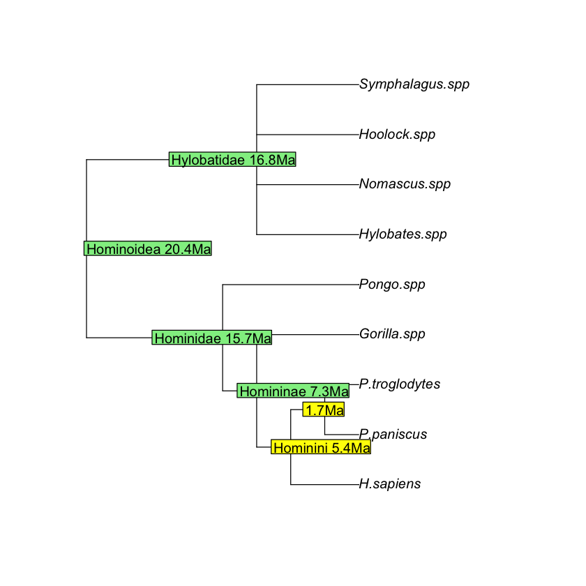

  

## Phylogenetic relationships of hominoidea family using the ape library
  

  
**Figure 2**. Phylogenetic relationships of the Hominoidae superfamily.This family embraces the current gorillas, chimpanzees, orangutans and humans. The common ancestor of bonobos (*Pan paniscus*) and chimpanzees (*P. troglodytes*) goes back to 1.7 Million years (Ma) and that shared by humans, and these primates 5.4Ma.  
